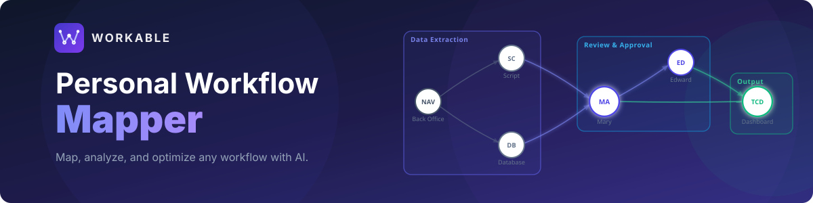
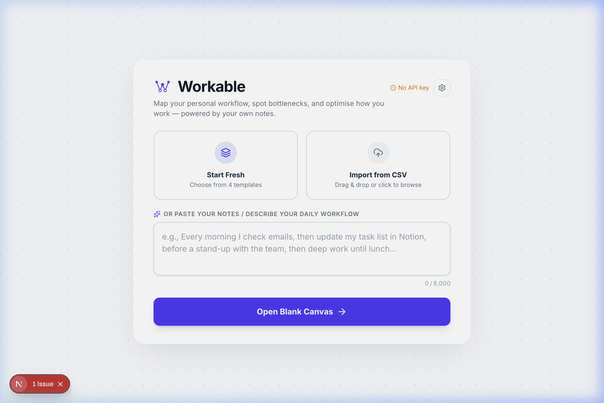
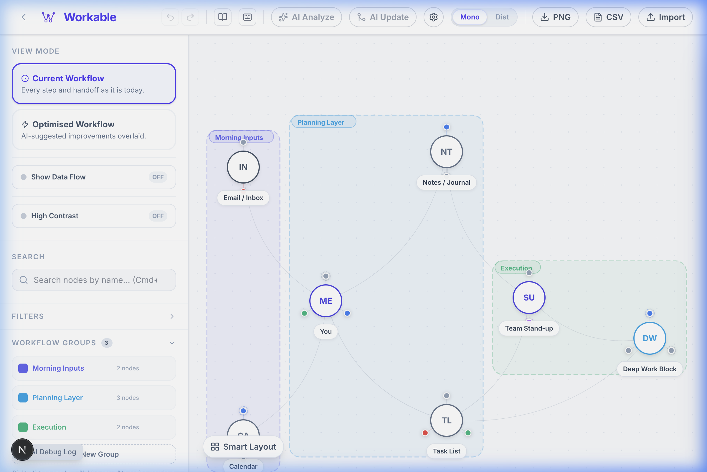
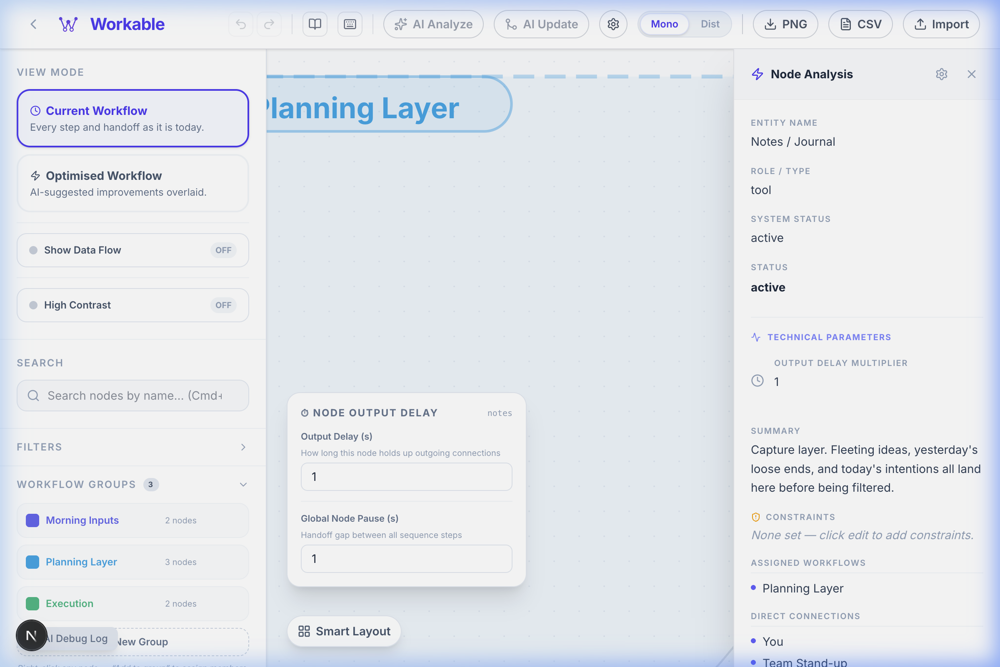

<div align="center">
  

  <br/><br/>

  <p>
    
    
    
    
    
    
  </p>
  <p align="center">
    <strong>Workable</strong> is a personal workflow engine that uses AI to transform your mental notes into structured, interactive process maps. 
    <br/>Spot bottlenecks, organize tasks, and optimize your daily routines — all in one unified canvas.
  </p>
  <p>
    <a href="#-features">Features</a> ·
    <a href="#-ai-providers">AI Providers</a> ·
    <a href="#-templates">Templates</a> ·
    <a href="./docs/README.md">Development Guide</a>
  </p>

  <br/>

  <p>
    <a href="https://workable-kappa.vercel.app/">
      
    </a>
  </p>
</div>

---

## What is Workable?

Most workflow tools make you drag and drop from scratch. Workable flips that.

You write (or paste) a plain-English description of how work actually flows — who does what, which tools are involved, where things get stuck. Workable's AI parses it into an interactive graph, groups related steps into named phases, assigns tasks to each node, and immediately flags the bottlenecks. You get a living map of your workflow that you can refine, export, and share. **Try the [Live Demo](https://workable-kappa.vercel.app/) to see it in action.**

### 🖼️ App Preview

<div align="center">
  
  
  <br/>
  <i>(Left: Landing page with template & text-to-graph input | Right: Interactive group-aware process map)</i>
</div>

---

## ✨ Features

### 🧠 AI-Powered Graph Generation
Describe your workflow in plain English — names, tools, handoffs, blockers, all of it. The AI infers:
- **Nodes** with roles (`person`, `tool`, `external source`, `output`)
- **Directed edges** with descriptive connection names
- **Workflow groups** (phases like "Data Ingestion" or "Review & Approval")
- **Tasks** per node with priority and status
- **Constraints** (GDPR limits, manual approvals, rate caps)

### 🗺️ Dual-View Canvas

<div align="center">
  
</div>

| Baseline Process Map | Ecosystem Hub |
|---|---|
| Left-to-right hierarchical flow | Radial web-map centred on the most-connected node |
| Clear sequence and handoffs | Visualise influence, coupling, and dependency rings |
| Great for process documentation | Great for spotting architectural smells |

Toggle instantly with no data loss using the **Mono/Dist** and **Ecosystem** toggles in the toolbar.

### 🔬 Analysis Sidebar

<div align="right">
  
</div>

Click any node or edge to open a deep-dive panel:
- **Entity name**, role badge, and AI-generated vs user-added origin
- **Summary** — concise description of the node's role in the workflow
- **Assigned Workflows** — which phases/groups this node belongs to
- **Direct Connections** — all neighbouring nodes (both directions)
- **Constraints** — operational, compliance, or technical limits
- **Tasks** — inline task list with status, priority, due date, and notes

For edges:
- **Data Flow Direction** — From → To pill with node names
- **Connection Name** — the actual named handoff (e.g. "Send Exception File for review")
- **Auto-generated summary** — what flows along this edge and why

<br clear="both"/>

### 🧩 Workflow Groups & Nested Phases
Colour-coded bounding regions that organise nodes into named phases. Supports:
- **Top-level groups** (e.g. "Daily Price Reconciliation")
- **Sub-groups** nested inside parent phases (e.g. "Automated Processing" inside the reconciliation group)
- **Group-aware physics layout** — groups cluster intelligently without overlap, sharing nodes pull related groups together

### ✅ Task Management
Every node can own a task list with:
- Status: `todo` / `in-progress` / `review` / `blocked` / `done`
- Priority: `low` / `medium` / `high`
- Due date + free-form notes
- Visual progress counters (`3/5 open`)

### 🔍 AI Bottleneck Analysis
Run the optimiser on any graph to get a structured report:
- **Workflow Summary** — two-sentence executive overview
- **Bottlenecks Identified** — specific nodes and edges by name
- **Constraint Analysis** — flags nodes with constraints that could propagate risk
- **Quick Wins** — highest impact-to-effort improvements with suggested new connections

### 🔀 AI Update
Describe any change in plain English and apply it as a precise patch — no rebuild from scratch:
- **Add** new people, tools, systems, or entire sub-workflows
- **Update** roles, summaries, constraints, and group memberships
- **Remove** departed team members or replaced tools (edges cascade automatically)
- Preview a colour-coded diff (**green** add / **amber** update / **red** remove) before committing
- Layout reflows automatically after every patch

### 🏗️ Distributed Reasoning (vb0.2)
Specifically for large graphs (100+ nodes) where monolithic AI prompts would hit context limits:
- **Ego-centric Analysis** — each node is analyzed as its own agent with local neighborhood context
- **Message Broker** — agents communicate changes along real graph edges to simulate cascades
- **Engine Toggle** — switch between Monolithic (fast/holistic) and Distributed (precise/scalable) on the fly
- **Scalability** — reasoning remains sharp regardless of total graph size

### 📤 Export & Import
| Format | What's included |
|---|---|
| **CSV** | All nodes, edges, positions, tasks, groups, settings |
| **PNG** | Full canvas render at current zoom |
| **CSV import** | Restore any previously exported workflow |

---

## 🚀 Quick Start

```bash
# 1. Clone and install
git clone https://github.com/starrdye/workable.git
cd workable
npm install

# 2. Start the dev server
npm run dev
# → http://localhost:3000
```

That's it. No `.env` file. No database. No signup.

**To enable AI features:**
1. Click **AI Settings** (gear icon) in the header
2. Pick your provider (Anthropic, Gemini, or ByteDance Doubao)
3. Paste your API key — it stays in your browser's `localStorage`, never hits a server
4. Describe your workflow and hit **Generate**

---

## 🤖 AI Providers

Workable is provider-agnostic. Swap between them any time in AI Settings.

| Provider | Models | Notes |
|---|---|---|
| **Anthropic Claude** | `claude-sonnet-4-6` (default), `claude-opus-4-6`, `claude-haiku-4-5` | Best overall reasoning and JSON fidelity |
| **Google Gemini** | `gemini-2.0-flash` (default), `gemini-1.5-pro`, `gemini-1.5-flash` | Fast, generous free tier |
| **ByteDance Doubao** | Your endpoint ID (e.g. `ep-20260318…`) | OpenAI-compatible; supports Coding Plan base URL |

**Detailed technical documentation can be found in the [Development Guide](./docs/README.md).**

---

## 🧩 Templates

Templates ship with full metadata — tasks, summaries, constraints, and workflow groups — so you get a rich, ready-to-explore graph the moment you pick one.

### Morning Routine (7 nodes)
```
[Email / Inbox] ──┐
                  ├──▶ [You] ──▶ [Notes] ──▶ [Stand-up] ──▶ [Deep Work]
[Calendar]     ──┘           └──▶ [Task List] ──────────────────────────▶ ▲
```
Groups: Morning Inputs · Planning Layer · Execution

### Project Workflow (14 nodes)
Idea → Research → Outline → Draft → (Reviewer A + Reviewer B) → Feedback → Publish → Analytics → Archive

Groups: Discovery · Production · Review Loop · Distribution

### Full Work Week (22 nodes)
Five external input streams → capture + planning → you (hub) → deep work blocks + collaboration → deliverables + published content + weekly KPIs

Groups: External Inputs · Capture & Plan · Deep Focus · Collaboration · Outputs & Review

---

## 📄 License

MIT © 2026 — do whatever you want, just don't blame us when your workflow still has bottlenecks.

---

<div align="center">
  <sub>Built with Next.js · React 19 · Tailwind CSS · Anthropic Claude · Google Gemini · ByteDance Doubao</sub>
</div>
