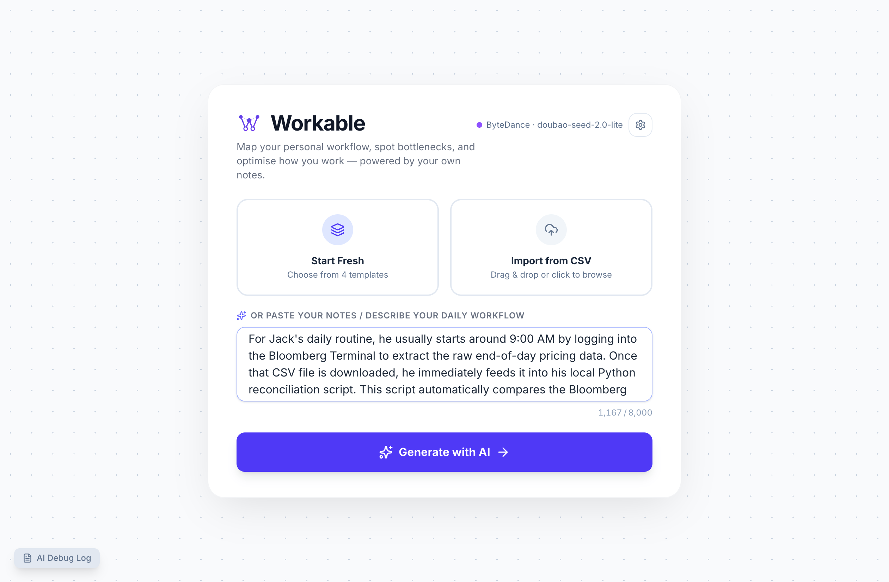
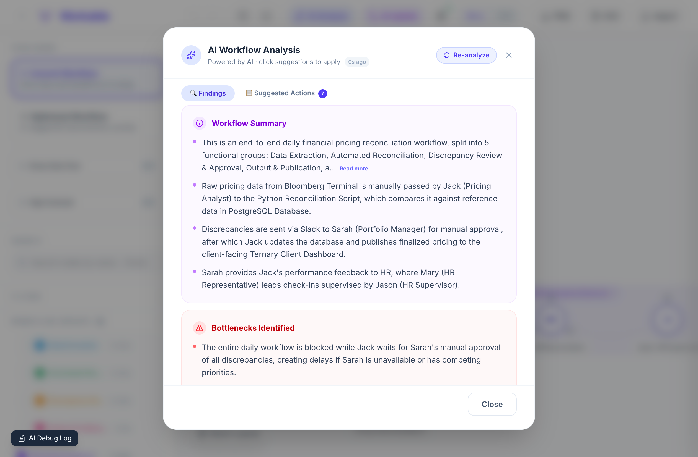
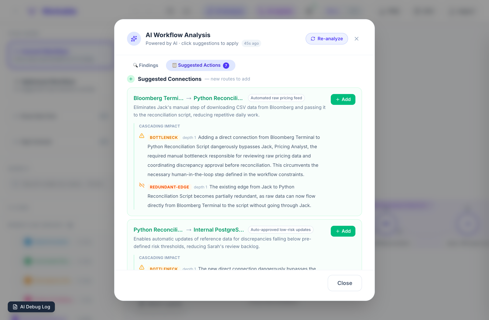
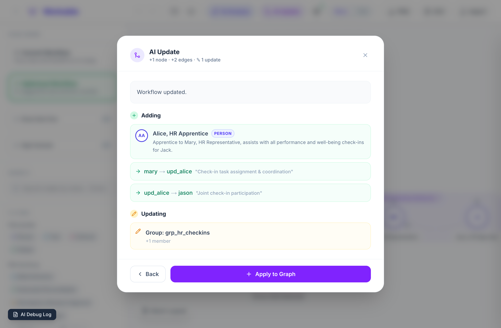
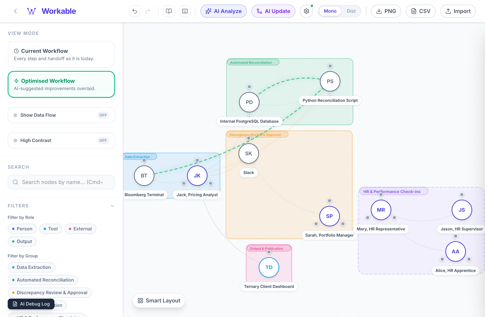
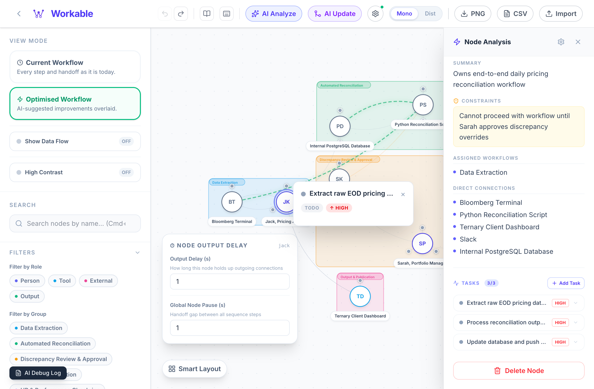

<div align="center">
  

  <br/><br/>

  <p>
    
    
    
    
    
    
  </p>
  <p align="center">
    <strong>Workable</strong> is a personal workflow engine that uses AI to transform your mental notes into structured, interactive process maps. 
    <br/>Spot bottlenecks, organize tasks, and optimize your daily routines — all in one unified canvas.
  </p>
  <p>
    <a href="#-features">Features</a> ·
    <a href="#-ai-providers">AI Providers</a> ·
    <a href="#-templates">Templates</a> ·
    <a href="./docs/README.md">Development Guide</a>
  </p>

  <br/>

  <p>
    <a href="https://workable-kappa.vercel.app/">
      
    </a>
  </p>
</div>

---

## What is Workable?

Most workflow tools make you drag and drop from scratch. Workable flips that. 

You write (or paste) a plain-English description of how work actually flows — who does what, which tools are involved, where things get stuck. Workable's AI parses it into an interactive graph, groups related steps into named phases, assigns tasks to each node, and immediately flags the bottlenecks. Try the [Live Demo](https://workable-kappa.vercel.app/) to see it in action.

---

## ✨ Features

### 🧠 AI-Powered Graph Generation
Transform a paragraph of text into a complete, structured process map in seconds.

<div align="center">
  <table>
    <tr>
      <td width="50%" align="center"><b>1. Describe your workflow</b></td>
      <td width="50%" align="center"><b>2. AI generates the graph</b></td>
    </tr>
    <tr>
      <td></td>
      <td></td>
    </tr>
  </table>
  <p><i>The AI identifies nodes, roles, directed edges, and logical workflow groups automatically.</i></p>
</div>

---

### 🔍 AI Bottleneck Analysis
Stop guessing where your process is failing. Run the optimizer to see structural risk.

<div align="center">
  <table>
    <tr>
      <td width="50%" align="center"><b>Spot structural weaknesses</b></td>
      <td width="50%" align="center"><b>Get suggested actions</b></td>
    </tr>
    <tr>
      <td></td>
      <td></td>
    </tr>
  </table>
  <p><i>The engine flags "Single point of failures" and suggests specific fixes to optimize throughput.</i></p>
</div>

---

### 🔀 AI Update & Patching
Modify your workflow by just describing the change. No need to rebuild from scratch.

<div align="center">
  <table>
    <tr>
      <td width="50%" align="center"><b>Review the proposed change</b></td>
      <td width="50%" align="center"><b>Apply the update instantly</b></td>
    </tr>
    <tr>
      <td></td>
      <td></td>
    </tr>
  </table>
  <p><i>Review precise patches (additions, updates, removals) before applying them to your canvas.</i></p>
</div>

---

### 🔬 Interactive Exploration & Tasks
Click any node to reveal its deep-dive profile, constraints, and assigned tasks.

<div align="center">
  <table>
    <tr>
      <td width="50%" align="center"><br/><b>Deep-dive analysis</b></td>
      <td width="50%" align="center"><br/><b>Actionable task lists</b></td>
    </tr>
  </table>
</div>

---

### 🗺️ Flexible Canvas Views
Toggle between the standard **Process Map** (hierarchical flow) and the **Ecosystem Hub** (radial dependency web).

<div align="center">
  
  <p><i>Quickly spot influence hubs and dependency rings that regular charts hide.</i></p>
</div>

---

## 🚀 Quick Start

```bash
# 1. Clone and install
git clone https://github.com/starrdye/workable.git
cd workable
npm install

# 2. Start the dev server
npm run dev
# → http://localhost:3000
```
**AI Setup:** Click the gear icon in the header, select your provider (Claude, Gemini, or Doubao), and paste your API key (stored locally in your browser).

---

## 🤖 AI Providers

Workable is provider-agnostic. Swap between them any time to compare results.
- **Anthropic Claude**: Best overall reasoning and JSON fidelity (`claude-3-5-sonnet`).
- **Google Gemini**: Fast, reliable, and generous free tier (`gemini-1.5-pro`).
- **ByteDance Doubao**: High-performance models with local server endpoints.

---

## 📄 License

MIT © 2026 — do whatever you want, just don't blame us when your workflow still has bottlenecks.

---

<div align="center">
  <sub>Built with Next.js · React 19 · Tailwind CSS · Anthropic Claude · Google Gemini · ByteDance Doubao</sub>
</div>
