<p align="right"><strong>🌐 Language / 语言：</strong> <strong>English</strong> | <a href="README_zh.md">简体中文</a></p>

<div align="center">
  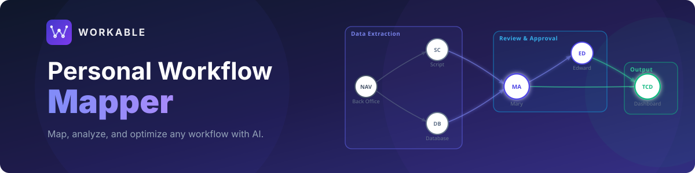

  <br/><br/>

  <p>
    
    
    
    
    
    
  </p>
  <p align="center">
    <strong>Workable</strong> is a personal workflow engine that uses AI to transform your mental notes into structured, interactive process maps. 
    <br/>Spot bottlenecks, organize tasks, and optimize your daily routines — all in one unified canvas.
  </p>
  <p>
    <a href="#-features">Features</a> ·
    <a href="#-ai-providers">AI Providers</a> ·
    <a href="#-quick-start">Quick Start</a> ·
    <a href="./docs/README.md">Development Guide</a>
  </p>

  <br/>

  <p>
    <a href="https://workable-demo.tooboss.com/">
      
    </a>
  </p>
</div>

---

## What is Workable?

Most workflow tools make you drag and drop from scratch. Workable flips that. 

You write (or paste) a plain-English description of how work actually flows — who does what, which tools are involved, where things get stuck. Workable's AI parses it into an interactive graph, groups related steps into named phases, assigns tasks to each node, and immediately flags the bottlenecks. Try the [Live Demo](https://workable-demo.tooboss.com/) to see it in action.

---

## 📺 Video Demo

<div align="center">
  <a href="https://www.youtube.com/watch?v=l7Gm6z4NUcM">
    
  </a>
  <p><i>Click above to watch the full walkthrough on YouTube (English)</i></p>
</div>

---

## ✨ Features

### 🧠 AI-Powered Graph Generation
Transform a paragraph of text into a complete, structured process map in seconds.

<div align="center">
  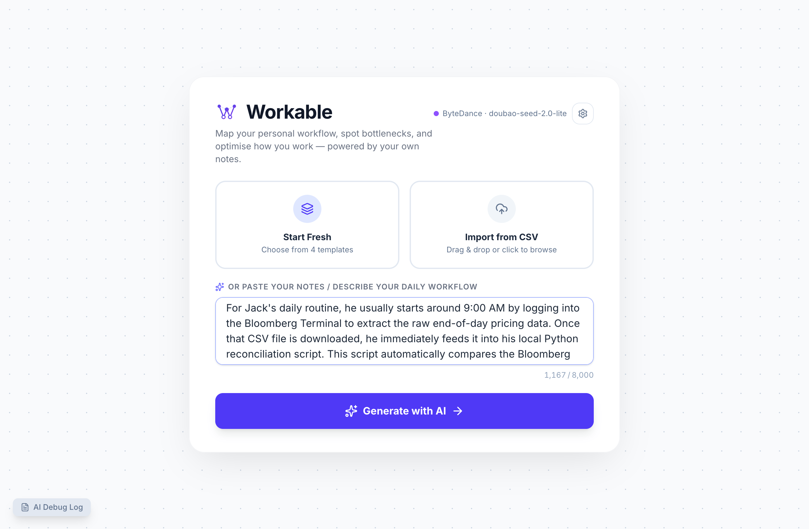
  <p><b>1. Describe your workflow</b>: Input your process in plain English — no technical syntax required.</p>
  
  <br/>

  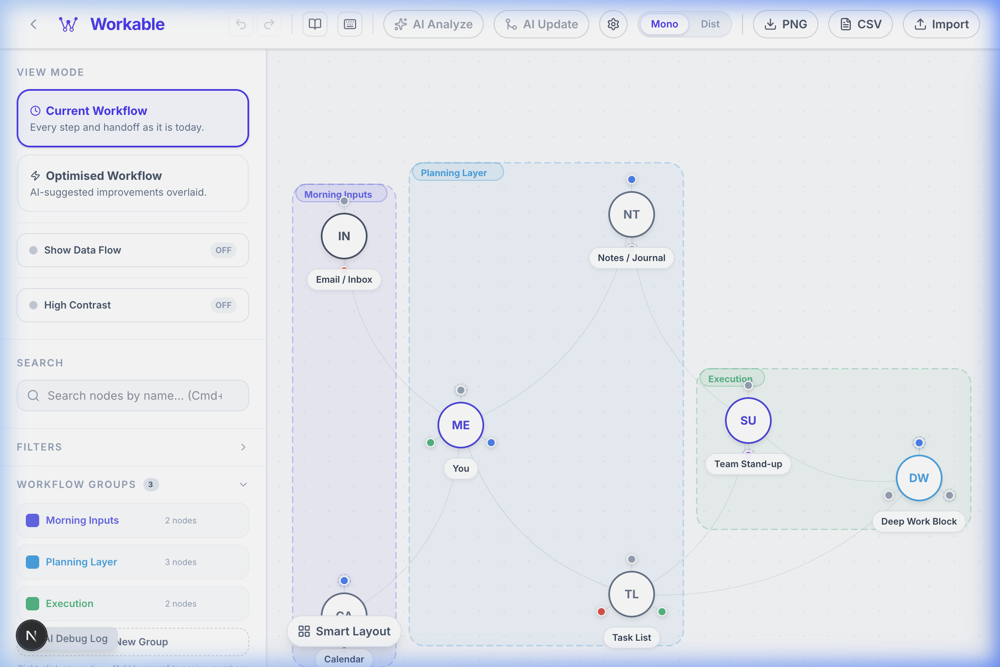
  <p><b>2. AI generates the graph</b>: The engine automatically identifies nodes, roles, directed edges, and logical groups.</p>
</div>

---

### 🔍 AI Bottleneck Analysis
Stop guessing where your process is failing. Run the optimizer to see structural risk.

<div align="center">
  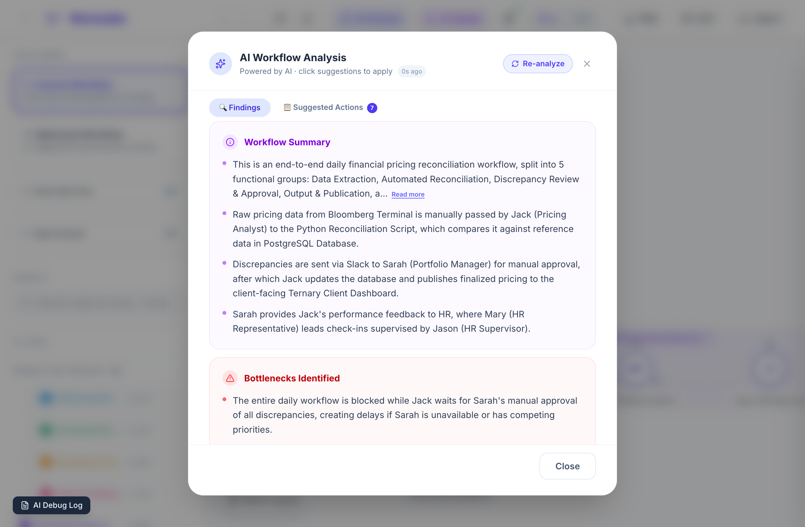
  <p><b>Spot structural weaknesses</b>: The AI identifies "single points of failure" and structural risks in your workflow.</p>

  <br/>

  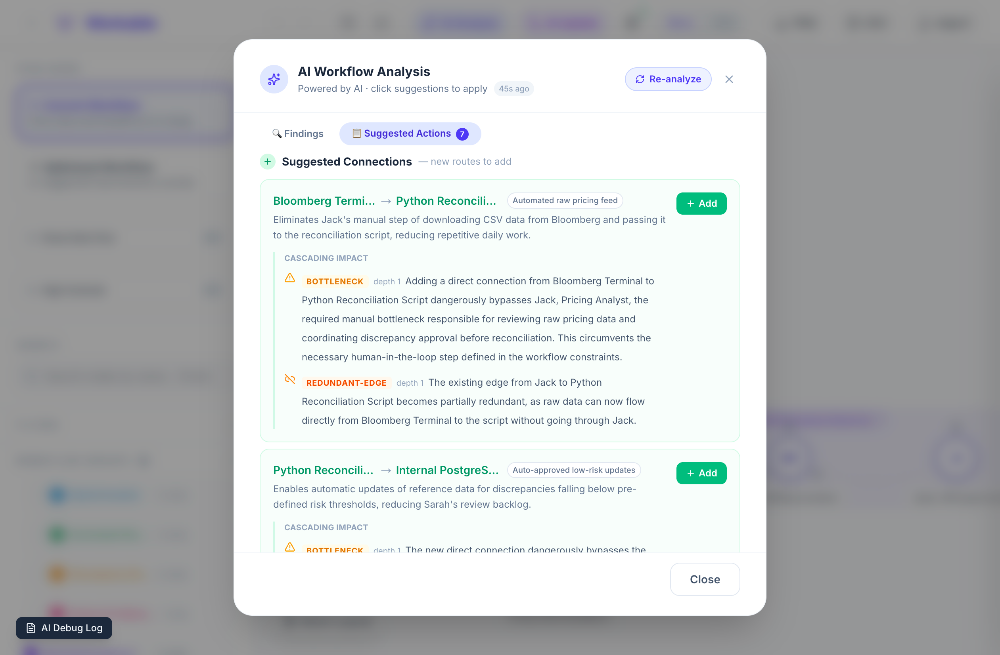
  <p><b>Get suggested actions</b>: Receive specific, actionable recommendations to optimise throughput and reduce risk.</p>
</div>

---

### 🔀 AI Update & Patching
Modify your workflow by just describing the change. No need to rebuild from scratch.

<div align="center">
  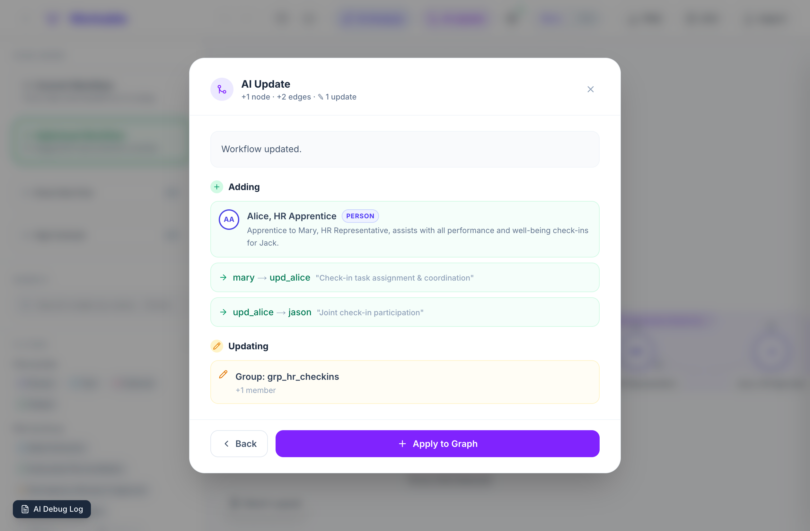
  <p><b>Review the proposed change</b>: See a precise preview of additions, removals, and updates before committing them.</p>

  <br/>

  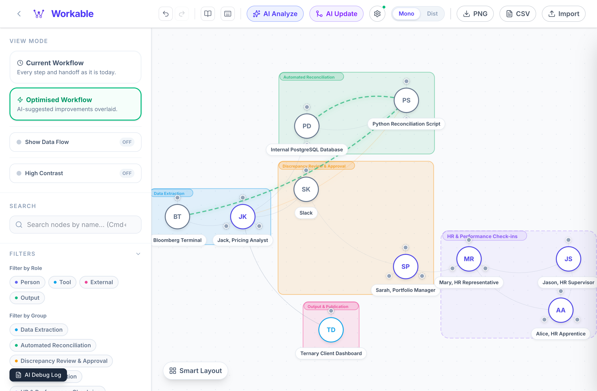
  <p><b>Apply the update instantly</b>: The workflow reflows automatically to incorporate your changes without a full rebuild.</p>
</div>

---

### 🔬 Interactive Exploration & Tasks
Click any node to reveal its deep-dive profile, constraints, and assigned tasks. Task dots orbit each node — click one for a quick-view popup with status, priority, and description.

<div align="center">
  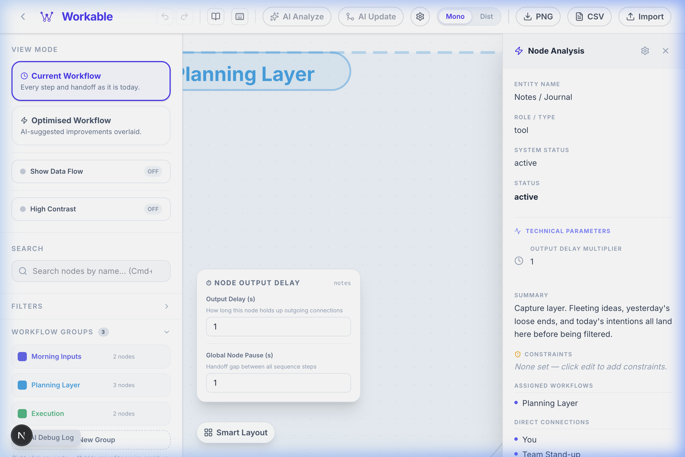
  <p><b>Deep-dive analysis</b>: Access entity profiles, constraints, and connection summaries in a persistent panel.</p>

  <br/>

  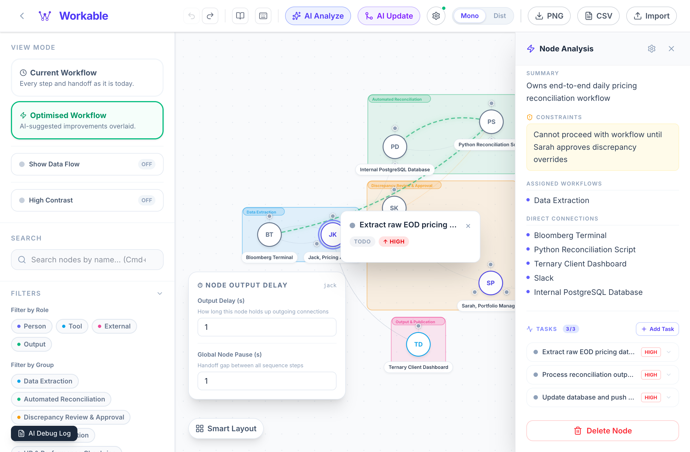
  <p><b>Actionable task lists</b>: Manage TODOs directly on the canvas or via node-specific task drawers.</p>
</div>

---

### ✅ Optimised Workflow View
Toggle between the **Current Workflow** and **Optimised Workflow** to see AI-suggested improvements overlaid on your canvas. New connections appear as dashed emerald arcs; deprecated ones fade out.

<div align="center">
  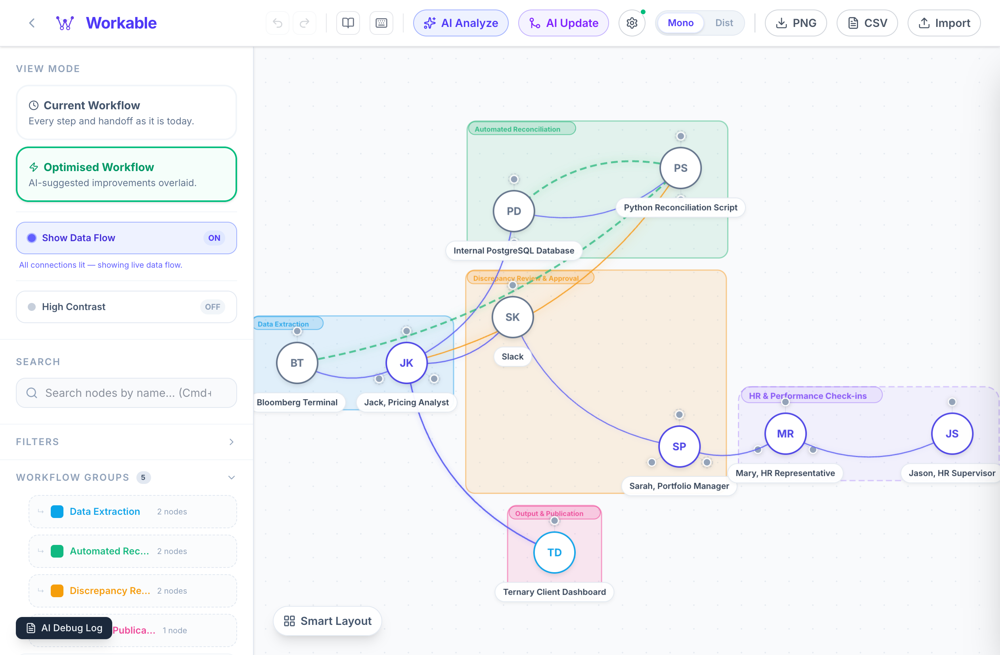
  <p><i>Switch views without losing your original — the optimised overlay is non-destructive until you apply it.</i></p>
</div>

---

### 🗺️ Flexible Canvas Views
Toggle between the standard **Process Map** (hierarchical flow) and the **Ecosystem Hub** (radial dependency web).

<div align="center">
  
  <p><i>Quickly spot influence hubs and dependency rings that regular charts hide.</i></p>
</div>

---

### 🔎 Search & Role Filters
Search by node name or filter the canvas by role type (Person, Tool, External, Output) and workflow group. Non-matching nodes dim, so your focus stays sharp.

<div align="center">
  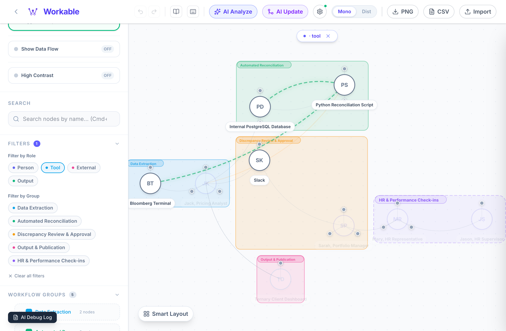
  <p><i>Combine role and group filters to isolate any slice of your process instantly.</i></p>
</div>

---

### 🖱️ Right-Click Node Editing
Right-click any node to set output delay, assign it to workflow groups, add manual connections, or delete it. The analysis panel stays open beside you.

<div align="center">
  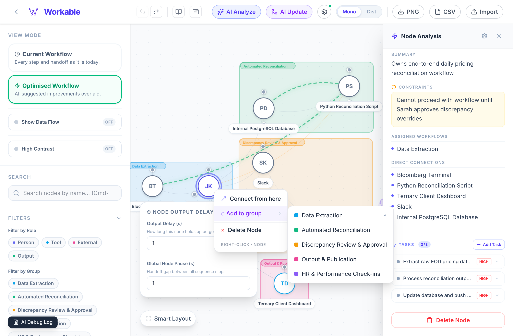
  <p><i>Every structural edit is reflected immediately — no save button, no page reload.</i></p>
</div>

---

### 💾 Workflow Library
Name and save any canvas state to the built-in Workflow Library. Load it back instantly, or delete old versions you no longer need.

<div align="center">
  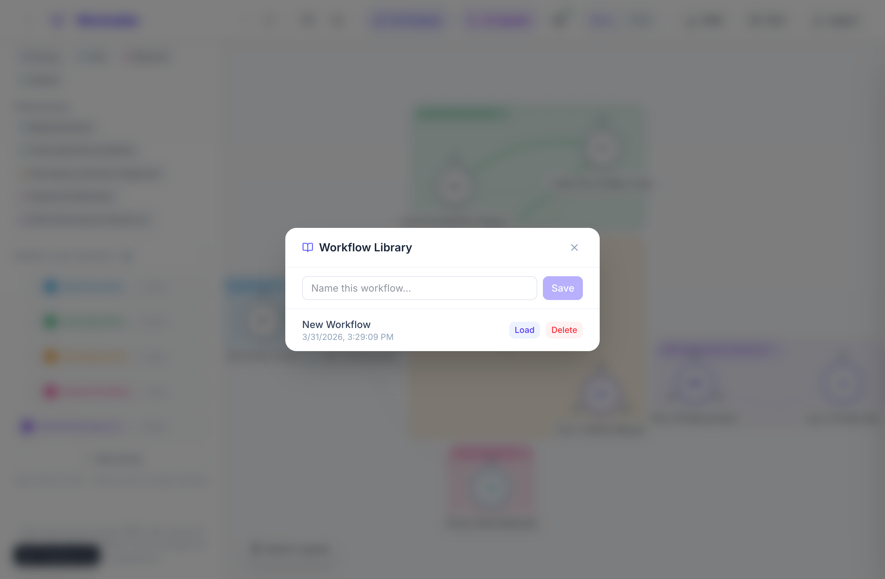
  <p><i>Snapshots are stored locally in your browser — no account or cloud sync required.</i></p>
</div>

---

### 📂 Workflow Group Hierarchy
Organize your canvas into levels. Create parent-subgroup relationships to manage complex processes. The sidebar automatically indents subgroups and provides a recursive node count (Parent = Parent Nodes + Subgroup Nodes) for a true high-level overview.

<div align="center">
  
  <p><i>Use the "Move to..." icon in the sidebar to reorganize your phases. Circular dependency protection is built-in.</i></p>
</div>

### 🛰️ Hermes Team Map (experimental)
If you run a local [Hermes](https://hermes-agent.nousresearch.com) agent team, Workable can draw it at `/hermes`: profiles become nodes, delegation becomes edges, kanban cards become task dots, and chats show up live, with the agent that's working outlined in indigo. Four views of the same graph:

- **Team**: who does what, with each profile's model and whether it runs unattended.
- **Live**: task dots, pulses along edges as cards are handed off, and an amber glow on the current bottleneck, computed from real run history (blocked cards, stale reviews, failure rate).
- **Projects**: boards and projects, and a reminder of where memory is and isn't separated.
- **Replay**: step through one card's history and see how long each profile held it.

**Live chats.** Besides the kanban board, the map reads each profile's session store (read-only: titles, times and tool names, never message text). Updates are pushed over a live stream (`/api/hermes/stream`) the moment Hermes writes, so a profile shows **replying · thinking / used terminal** as soon as you send a message, then **replied**, **reply failed**, **cut off** or **no reply**. Your messages and its replies pulse along the edge, and the side panel lists its recent chats. Every reconnect starts from a full fresh snapshot. Add more installs with `WORKABLE_HERMES_HOMES=test=~/.hermes-test,personal=~/.hermes` to switch between them in the toolbar; edits only ever apply to `HERMES_HOME`.

By default the view is read-only: it opens the kanban database in read-only mode and never writes to `~/.hermes`. Turn it on with `NEXT_PUBLIC_WORKABLE_HERMES=true` in `.env.local` (set `HERMES_HOME` if your install isn't at `~/.hermes`), then use the **Hermes** button in the header.

**Editing (optional).** With `WORKABLE_HERMES_EDIT=true`, you can add an agent, edit a profile's description or model, or create a project with its own board. Every change is shown first as a diff plus the exact `hermes` commands it will run; nothing is written until you press Apply, and every file it touches is backed up under `$HERMES_HOME/backups/workable/`. New workers copy the rules block from an existing worker word for word and never get desktop control. Try it on a separate test install (`HERMES_HOME=~/.hermes-test`) first.

**Window in the Hermes app.** `bash hermes-plugin/install.sh` installs a desktop plugin that adds a **Workable** pane beside the Hermes chat (Team map or Canvas), a sidebar page and ⌘K commands. When Hermes maps a workflow with the MCP tools, a live card of the graph appears right in its reply. The pane shows Workable in Hermes's sandboxed frame; `src/proxy.ts` lets that frame reach Workable's API only with the `WORKABLE_EMBED_TOKEN` the script puts in `.env.local`, and never lets it change Hermes. Adding or editing agents stays in the browser.

**MCP server.** `npm run mcp` starts a stdio MCP server so an agent system can use Workable without the UI: `generate_workflow`, `analyze_bottlenecks`, `patch_workflow` and `push_to_canvas`. By default it asks the calling client to run each prompt (MCP sampling), so Workable needs no API key of its own. To register it with Hermes:

```bash
hermes mcp add workable --command node --env WORKABLE_URL=http://localhost:3000 \
  --args <repo>/node_modules/tsx/dist/cli.mjs --tsconfig <repo>/tsconfig.json <repo>/mcp/server.ts
```

---

## 🚀 Quick Start

```bash
# 1. Clone and install
git clone https://github.com/starrdye/workable.git
cd workable
npm install

# 2. Start the dev server
npm run dev
# → http://localhost:3000
```
**AI Setup:** Click the gear icon in the header, select your provider (Claude, Gemini, or Doubao), and paste your API key (stored locally in your browser).

---

## 🤖 AI Providers

Workable is provider-agnostic. Swap between them any time to compare results.
- **Anthropic Claude**: Best overall reasoning and JSON fidelity. Supports `claude-opus-4-6`, `claude-sonnet-4-6` (recommended), and `claude-haiku-4-5`.
- **Google Gemini**: Fast, reliable, and generous free tier. Supports `gemini-2.0-flash`, `gemini-1.5-pro`, and `gemini-1.5-flash`.
- **ByteDance Doubao**: High-performance models via standard pay-per-use endpoints or the Coding Plan (`doubao-seed-2.0`, `doubao-pro-32k`, and more).

---

## 📄 License

GNU Affero General Public License v3.0 (AGPL-3.0) © 2026 — share and share alike, even in the cloud.

---

<div align="center">
  <sub>Built with Next.js · React 19 · Tailwind CSS · Anthropic Claude · Google Gemini · ByteDance Doubao</sub>
</div>
