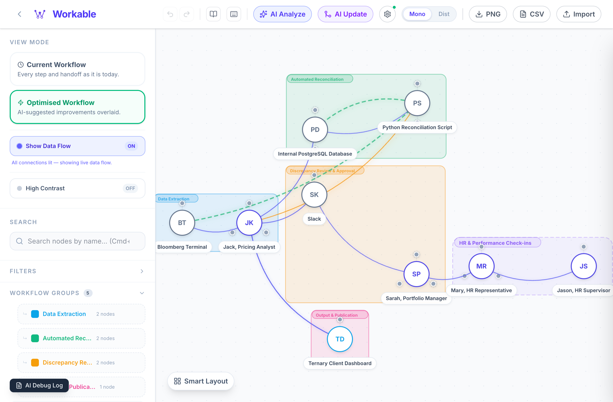
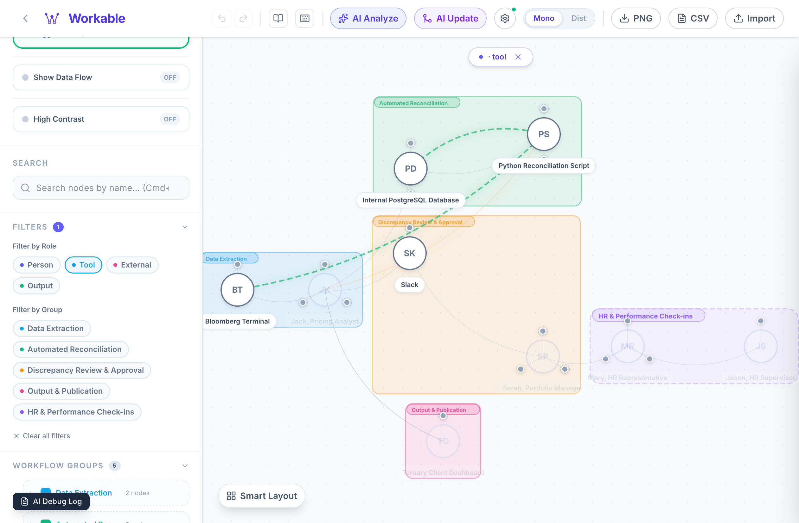
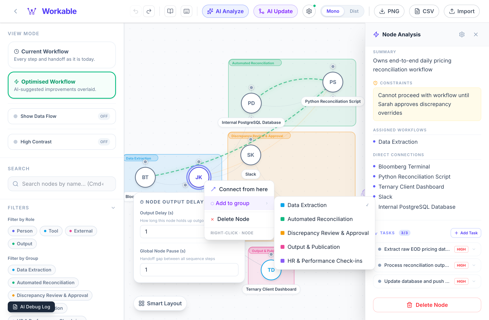
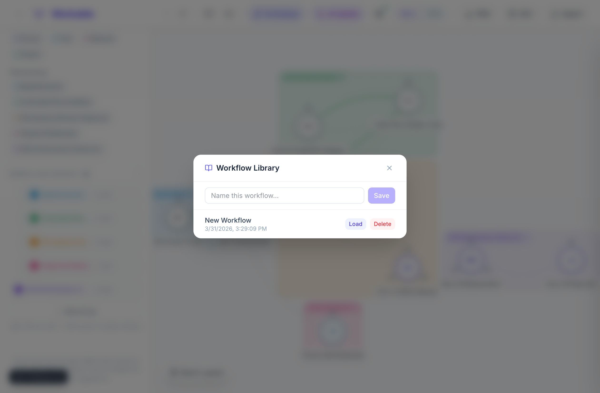

<p align="right"><strong>🌐 语言 / Language：</strong> <a href="README.md">English</a> | <strong>简体中文</strong></p>

<div align="center">
  

  <br/><br/>

  <p>
    
    
    
    
    
    
  </p>
  <p align="center">
    <strong>Workable</strong> 是一款个人工作流引擎，借助 AI 将你的思路笔记转化为结构化的交互式流程图。
    <br/>定位瓶颈、管理任务、优化日常工作流——一切尽在统一画布之上。
  </p>
  <p>
    <a href="#-功能特性">功能特性</a> ·
    <a href="#-ai-模型提供商">AI 提供商</a> ·
    <a href="#-快速开始">快速开始</a> ·
    <a href="./docs/README.md">开发指南</a>
  </p>

  <br/>

  <p>
    <a href="https://workable-kappa.vercel.app/">
      
    </a>
  </p>
</div>

---

## Workable 是什么？

大多数工作流工具要求你从零开始拖放搭建。Workable 反其道而行之。

你只需用自然语言描述工作的实际流转方式——谁负责什么、涉及哪些工具、哪里容易卡壳。Workable 的 AI 会将其解析为交互式关系图，将相关步骤归入命名阶段，为每个节点分配任务，并立即标记出瓶颈所在。体验 [在线演示](https://workable-kappa.vercel.app/)，立刻看到效果。

---

## ✨ 功能特性

### 🧠 AI 驱动的图谱生成
几秒钟内，将一段文字转化为完整的结构化流程图。

<div align="center">
  
  <p><b>1. 描述你的工作流</b>：用自然语言输入你的流程——无需任何技术语法。</p>

  <br/>

  
  <p><b>2. AI 自动生成图谱</b>：引擎自动识别节点、角色、有向边及逻辑分组。</p>
</div>

---

### 🔍 AI 瓶颈分析
不再凭感觉猜测问题所在。运行优化器，直观呈现结构性风险。

<div align="center">
  
  <p><b>发现结构性弱点</b>：AI 识别工作流中的"单点故障"和结构性风险。</p>

  <br/>

  
  <p><b>获取行动建议</b>：收到具体、可落地的优化建议，提升吞吐量、降低风险。</p>
</div>

---

### 🔀 AI 更新与修补
只需描述变更内容，即可修改工作流。无需从头重建。

<div align="center">
  
  <p><b>审查变更预览</b>：在提交前，精确查看新增、删除和更新的内容。</p>

  <br/>

  
  <p><b>即时应用更新</b>：工作流自动重排，无缝融入你的变更，无需完整重建。</p>
</div>

---

### 🔬 交互式探索与任务管理
点击任意节点，查看其深度档案、约束条件和已分配任务。任务点环绕节点排列——点击可弹出快速查看窗口，显示状态、优先级和描述。

<div align="center">
  
  <p><b>深度分析面板</b>：在持久化面板中访问实体档案、约束条件和连接摘要。</p>

  <br/>

  
  <p><b>任务点弹窗</b>：直接在画布上管理待办事项，或通过节点专属任务抽屉操作。</p>
</div>

---

### ✅ 优化工作流视图
在**当前工作流**与**优化后工作流**之间切换，将 AI 建议的改进叠加显示在画布上。新增连接以虚线绿弧呈现；已废弃的连接则淡出消隐。

<div align="center">
  
  <p><i>切换视图不会丢失原始内容——优化叠加层在你应用之前始终是非破坏性的。</i></p>
</div>

---

### 🗺️ 灵活的画布视图
在标准**流程图**（层级流）与**生态系统图**（辐射依赖网）之间自由切换。

<div align="center">
  
  <p><i>快速发现普通图表所隐藏的影响力中心和依赖环。</i></p>
</div>

---

### 🔎 搜索与角色筛选
按节点名称搜索，或按角色类型（人员、工具、外部、输出）和工作流分组筛选画布。不匹配的节点自动变暗，让你的注意力保持聚焦。

<div align="center">
  
  <p><i>结合角色和分组筛选，即时聚焦到流程的任意切面。</i></p>
</div>

---

### 🖱️ 右键节点编辑
右键点击任意节点，可设置输出延迟、分配到工作流分组、添加手动连接或删除节点。分析面板始终保持在侧。

<div align="center">
  
  <p><i>所有结构性编辑即时生效——无需保存按钮，无需刷新页面。</i></p>
</div>

---

### 💾 工作流库
为任意画布状态命名并保存到内置工作流库。随时加载，或删除不再需要的旧版本。

<div align="center">
  
  <p><i>快照保存在浏览器本地——无需账号，无需云同步。</i></p>
</div>

---

### 📂 工作流分组层级
将你的画布组织为多个层级。创建父子分组关系，以管理复杂的流程。侧边栏会自动缩进子分组，并提供递归节点计数（父组 = 父组节点 + 所有子组节点），实现真正的高层级概览。

<div align="center">
  
  <p><i>使用侧边栏中的"移动到..."图标重新组织你的各阶段。内置循环依赖保护。</i></p>
</div>

---

## 🚀 快速开始

```bash
# 1. 克隆并安装依赖
git clone https://github.com/starrdye/workable.git
cd workable
npm install

# 2. 启动开发服务器
npm run dev
# → http://localhost:3000
```
**AI 配置：** 点击顶栏的齿轮图标，选择你的提供商（Claude、Gemini 或 Doubao），粘贴 API 密钥（仅保存在浏览器本地）。

---

## 🤖 AI 模型提供商

Workable 不绑定特定提供商，随时切换以对比效果。
- **Anthropic Claude**：推理能力与 JSON 生成质量最佳。支持 `claude-opus-4-6`、`claude-sonnet-4-6`（推荐）和 `claude-haiku-4-5`。
- **Google Gemini**：响应速度快，免费额度充裕。支持 `gemini-2.0-flash`、`gemini-1.5-pro` 和 `gemini-1.5-flash`。
- **字节跳动 Doubao**：高性能模型，支持按量付费端点或 Coding Plan（`doubao-seed-2.0`、`doubao-pro-32k` 等）。

---

## 📄 许可证

GNU Affero 通用公共许可证 v3.0（AGPL-3.0）© 2026 — 自由使用，云端部署同样需要开源。

---

<div align="center">
  <sub>基于 Next.js · React 19 · Tailwind CSS · Anthropic Claude · Google Gemini · 字节跳动 Doubao 构建</sub>
</div>
